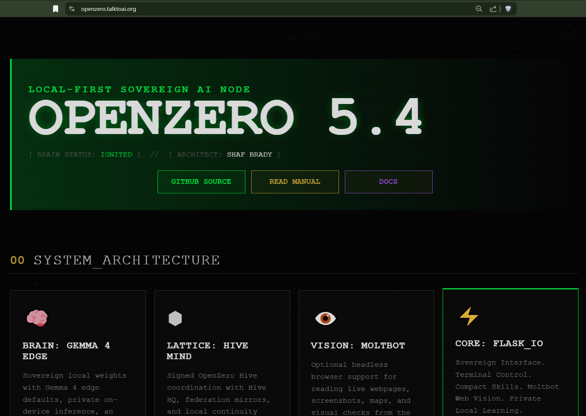

# OpenZero

<p align="center">
  
</p>

OpenZero is a local-first AI node and operator panel for machines you control. It focuses on practical local automation: model setup, service checks, file and archive work, optional web reading through Moltbot, offline release builds, and privacy-aware federation controls.

Public site: https://openzero.talktoai.org/

Docs: https://docs.talktoai.org/openzero/

## Featured Ecosystem Video

[](https://www.youtube.com/watch?v=R52hsRdCmSM)

Watch the ecosystem overview: [TalkToAI: Sovereignty Through ZeroThink and OpenZero Infrastructure](https://www.youtube.com/watch?v=R52hsRdCmSM). It shows how ZeroThink, OpenZero, local-first infrastructure, and the wider TalkToAI product stack fit together.

## What Is In This Repository

- `openzero/` contains the public OpenZero node, panel templates, installers, watchdog helpers, and local client-side federation code.
- `docs/` explains the security model, Hive boundary, private extension policy, and release checks.
- `openzero/docs/ZSPARK.md` documents the custom Z-Spark draft-verify path inspired by DSpark-style speculative decoding.
- `.github/workflows/ci.yml` runs a lightweight syntax check for the Python source.

## What Is Not Included

Production-only Hive HQ server internals, database credentials, private infrastructure settings, model weights, generated keys, runtime vaults, backups, and release archives are not committed here. The public node can run in local mode and can be configured to talk to a trusted Hive endpoint when the operator chooses.

## Quick Install

Review the installer before running it:

```bash
curl -fsSL https://openzero.talktoai.org/install.sh -o openzero-install.sh
less openzero-install.sh
bash openzero-install.sh
```

For a test machine you control:

```bash
curl -fsSL https://openzero.talktoai.org/install.sh | bash
```

Open the local panel after install:

```bash
http://localhost:1024
```

## Local Development

```bash
cd openzero
python3 -m venv .venv
source .venv/bin/activate
pip install -r requirements.txt
python -m compileall brain hivemind
```

The app expects local operator configuration. Start from `openzero/.env.example` and keep real `.env` files out of Git.

## Safety And Privacy Defaults

OpenZero is designed to keep private work local by default:

- Hive sharing is disabled unless the operator enables it.
- Chat contribution uses manual approval by default.
- Local filters block risky content from public/federated sharing.
- Runtime keys are generated on the target machine and ignored by Git.
- Server-only database config is intentionally not part of the public repo.

## License

This repository is source-available under the OpenZero Community Source License in `LICENSE`. It is intended for inspection, learning, personal use, internal business use, and contributions. Commercial resale, managed hosting, or claiming the project as your own product requires written permission.
