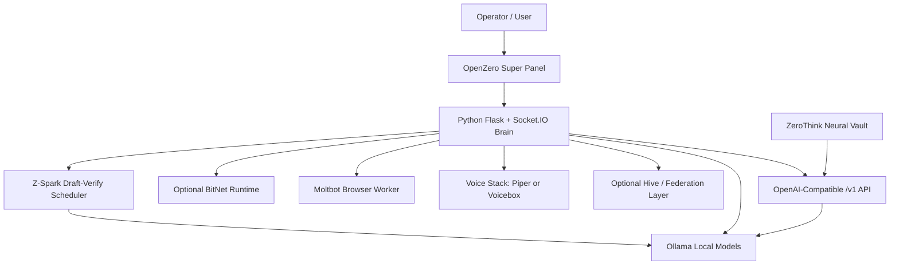

# Architecture

OpenZero is an open-core local AI node. It is built from small cooperating parts rather than one giant service.

## High-Level Map

## Main Components

| Component | Path | Purpose |
| --- | --- | --- |
| Brain app | `brain/app.py` | Web app, socket events, routing, API bridge, model actions, voice endpoints. |
| Config | `brain/openzero_config.py` | Defaults, `.env` loading/saving, CPU runtime profile logic. |
| Voice stack | `brain/voice_stack.py` | Piper speech, Voicebox proxy, local transcription. |
| Moltbot | `moltbot/moltbot.js` | Browser/text/page inspection helper. |
| Hive bridge | `hivemind/bridge.py` | Optional local/federated event paths. |
| Super Panel | `templates/index.html` | Main UI. |
| Manual | `templates/manual.html` | Built-in operator manual. |
| Installer | `install.sh` | Online install path. |
| Offline installer | `install_offline.sh` | Offline bundle install path. |

## Local Model Lane

OpenZero's normal local lane uses Ollama. The current default target is the Gemma 4 edge track, with fallback to compatible Gemma 3 models when needed.

The local model lane is used by:

- normal chat;
- `/v1/chat/completions`;
- ZeroThink bridge calls;
- local model repair/install actions.

## Z-Spark Draft-Verify Lane

Z-Spark sits above Ollama and below the chat/API routes. When enabled and ready, it asks a small local draft model for a compact candidate answer, estimates confidence, then asks the active target model to verify and rewrite. This gives OpenZero a DSpark-inspired pattern without requiring official DeepSeek DSpark checkpoints or target-model internals.

Read [ZSPARK.md](ZSPARK.md) for the full behavior and limits.

## Tool Lane

OpenZero can operate in chat and terminal/operator modes. Tool behavior includes:

- file inspection;
- local command execution where allowed by the installed user;
- archive creation/extraction;
- web page fetching;
- Moltbot browser inspection;
- web search through configured providers;
- SSH/SCP-style tasks when local keys and OS tools exist.

## Voice Lane

Voice is optional. OpenZero supports:

- faster-whisper for local transcription where installed;
- Piper as lightweight local/offline TTS;
- Voicebox as a richer local speech studio backend;
- fallback logic from Voicebox to Piper.

## ZeroThink Bridge

OpenZero can create an API key and expose a local OpenAI-compatible endpoint. ZeroThink can store the key in Neural Vault and route suitable work to the user's OpenZero node.

This is intentionally server-side. ZeroThink should not accept arbitrary browser-supplied OpenZero URLs.

## Public Vs Private Boundary

The public repo should contain:

- installable open-core node code;
- stable extension points;
- docs and setup examples;
- no private API keys;
- no premium/private module source.

Premium or private modules should live outside this public repository. See [PREMIUM_EXTENSIONS.md](PREMIUM_EXTENSIONS.md).
