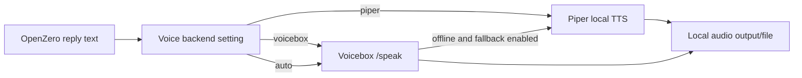

# Voicebox Integration

OpenZero can use Voicebox as an optional local voice studio backend.

Voicebox is not bundled into OpenZero. Install and run it separately from the official project:

```text
https://github.com/jamiepine/voicebox
```

## Why Use Voicebox

Piper is the lightweight offline fallback. Voicebox is the richer local voice studio path.

Use Voicebox when you want:

- cloned voice profiles;
- richer text-to-speech engines;
- Kokoro/LuxTTS-style local voice workflows;
- dictation/speech workflows from the Voicebox app;
- REST/MCP-friendly local voice automation;
- a more advanced voice layer for OpenZero replies.

## Default API

OpenZero expects Voicebox at:

```text
http://127.0.0.1:17493
```

You can change this in the Super Panel.

## OpenZero Panel Settings

Super Panel > Voice:

- Voice Output Backend: `piper`, `voicebox`, or `auto`;
- Voicebox URL;
- Voicebox Profile;
- Voicebox Engine;
- Language;
- Personality;
- Fallback to Piper;
- Check Voicebox;
- List Profiles;
- Open.

## Config Keys

| Key | Default | Purpose |
| --- | --- | --- |
| `VOICE_TTS_BACKEND` | `piper` | `piper`, `voicebox`, or `auto`. |
| `VOICEBOX_ENABLED` | `false` | Enables Voicebox path when true. |
| `VOICEBOX_URL` | `http://127.0.0.1:17493` | Voicebox API base URL. |
| `VOICEBOX_PROFILE` | blank | Optional profile name/id. |
| `VOICEBOX_ENGINE` | `auto` | Optional engine hint. |
| `VOICEBOX_LANGUAGE` | `en` | Language hint. |
| `VOICEBOX_PERSONALITY` | `false` | Personality flag passed when configured. |
| `VOICEBOX_FALLBACK_PIPER` | `true` | Try Piper if Voicebox fails. |
| `VOICEBOX_TIMEOUT_SECONDS` | `180` | Speech generation timeout. |

## Flow



## Health Checks

OpenZero provides:

```text
GET /api/voice/voicebox/status
GET /api/voice/voicebox/profiles
POST /api/voice/speak
```

If Voicebox is offline, the automatic status probe returns quickly so the Super Panel does not feel stuck.

